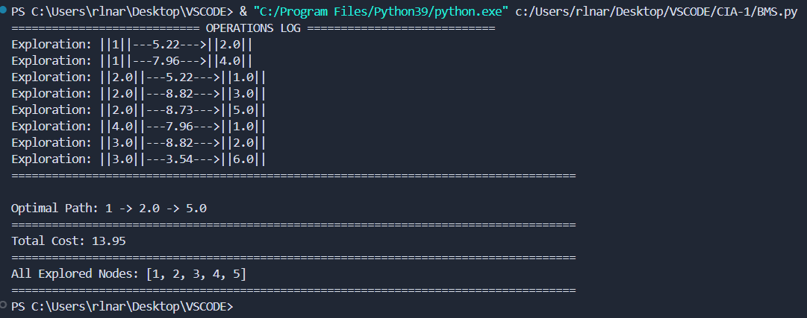
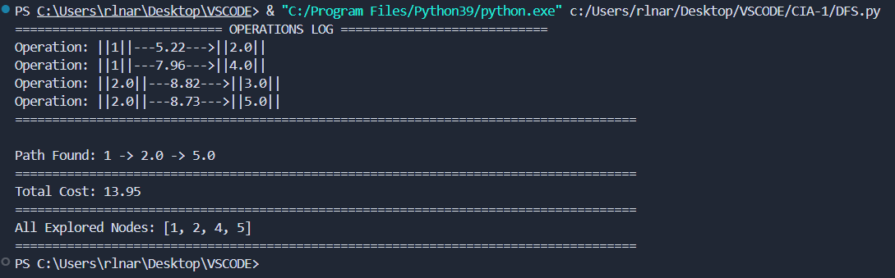
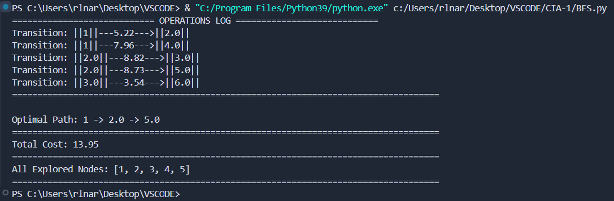
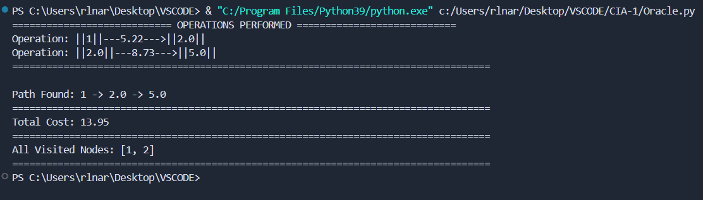

# Search Algorithms Demonstration

This project implements 12 search algorithms in Python, showcasing their functionality and comparing their performance on a graph. The project is designed for educational purposes and can serve as a foundational reference for understanding various search strategies in artificial intelligence.

## Table of Contents
- [Algorithms Overview](#algorithms-overview)
- [Installation](#installation)
- [Usage](#usage)
- [Algorithms](#algorithms)
  - [A Star](CIA-1/A-Star.py)
  - [AO Star](CIA-1/AO Star.py)
  - [BB Cost Est](CIA-1/BB Cost Est.py)
  - [Beam Search](CIA-1/ BFS.py)
  - [Best First Search](CIA-1/A Star.py)
  - [BFS](CIA-1/A Star.py)
  - [BMS](CIA-1/A Star.py)
  - [Branch and Bound](CIA-1/A Star.py)
  - [Dead Horse](CIA-1/A Star.py)
  - [DFS](CIA-1/A Star.py)
  - [Hill Climbing](CIA-1/A Star.py)
  - [Oracle](CIA-1/A Star.py)
    
## Algorithms Overview
This project includes various search algorithms, each with unique strategies for exploring a graph to find the optimal path from a start node to a goal node.

## Installation
To run this project, make sure you have Python installed along with the required libraries. You can install the necessary packages using pip:

```bash
pip install pandas networkx
```


### Algorithms
1. British Museum Search
Description: This search algorithm is inspired by the British Museum's way of organizing knowledge, focusing on systematic exploration and coverage.

Output:

2. Depth First Search (DFS)
Description: A graph traversal algorithm that explores as far as possible along each branch before backtracking.

Output:

3. Breadth First Search (BFS)
Description: An algorithm for traversing or searching tree or graph data structures, exploring all of a node's neighbors before moving on to the next level neighbors.

Output:

4. Hill Climbing
Description: A local search algorithm that continuously moves in the direction of increasing elevation or value to find the peak.

Output:

5. Beam Search
Description: A search algorithm that explores a graph by expanding the most promising nodes at each level, keeping only a specified number of best nodes.

Output:

6. Oracle Search
Description: An informed search algorithm that chooses the best neighbor based on the combined cost and heuristic to find the goal efficiently.

Output:

7. Branch and Bound
Description: A general algorithm for finding optimal solutions by systematically enumerating candidate solutions while avoiding those that are not feasible.

Output:

8. Dead Horse Search
Description: An unconventional approach that repeatedly explores nodes in a specific pattern until a goal is found or all nodes are exhausted.

Output:

9. Branch and Bound + Cost + Estimate
Description: An enhanced version of Branch and Bound that uses both cost and heuristic estimates to optimize the search process.

Output:

10. A* Search
Description: A popular pathfinding algorithm that combines features of Dijkstra's Algorithm and greedy best-first search, using a heuristic to guide its search.

Output:

11. AO* Search
Description: An extension of A* that can handle search problems with multiple goals or paths, optimizing the search process accordingly.

Output:

12. Best First Search
Description: An algorithm that explores paths based on their estimated cost to the goal, always selecting the most promising node to expand.

Output:

